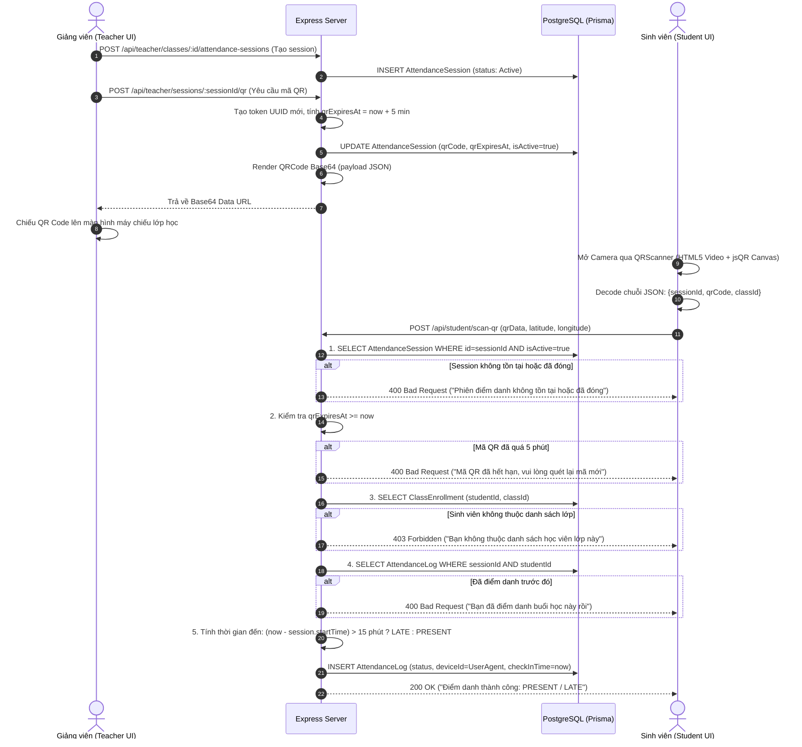
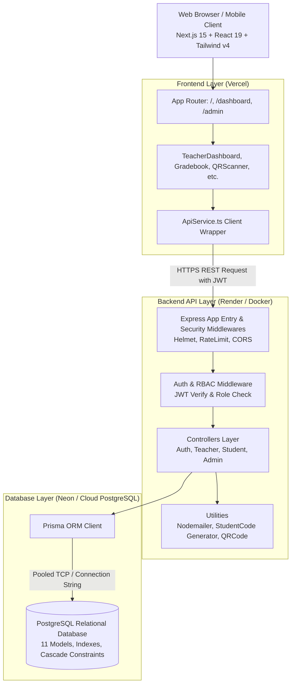

# PROJECT OVERVIEW: LightBrave.edu (Student Management System)

> **Tài liệu kỹ thuật tổng quan và phân tích codebase thực tế**  
> **Mục đích**: Cung cấp cơ sở dữ liệu kỹ thuật chuẩn xác, trung thực 100% dựa trên source code để hỗ trợ viết CV ứng tuyển vị trí **Fresher Full-Stack Developer** và chuẩn bị nội dung phỏng vấn kỹ thuật.  
> **Nguyên tắc**: Tuyệt đối không phóng đại năng lực, không bịa đặt tính năng, không để lộ secrets/credentials.

---

## MỤC LỤC

1. [Bối Cảnh Dự Án](#1-bối-cảnh-dự-án)
2. [Phân Tích Tổng Thể Codebase](#2-phân-tích-tổng-thể-codebase)
3. [Tổng Quan Hệ Thống (System Overview)](#3-tổng-quan-hệ-thống-system-overview)
4. [Technology Stack Thực Tế](#4-technology-stack-thực-tế)
5. [Chi Tiết Tính Năng Theo Role (Features)](#5-chi-tiết-tính-năng-theo-role-features)
6. [Backend & RESTful API Architecture](#6-backend--restful-api-architecture)
7. [Database Schema & Quan Hệ Thực Thể](#7-database-schema--quan-hệ-thực-thể)
8. [Phân Tích Chuyên Sâu: Cơ Chế Điểm Danh Bằng QR Code](#8-phân-tích-chuyên-sâu-cơ-chế-điểm-danh-bằng-qr-code)
9. [Frontend Architecture & UI Modules](#9-frontend-architecture--ui-modules)
10. [Kiến Trúc Hệ Thống (Architecture & Data Flow)](#10-kiến-trúc-hệ-thống-architecture--data-flow)
11. [Deployment & DevOps Configuration](#11-deployment--devops-configuration)
12. [Technical Highlights Cho CV Fresher](#12-technical-highlights-cho-cv-fresher)
13. [CV-READY INFORMATION (English Section)](#13-cv-ready-information-english-section)
14. [Đánh Giá Độ Phù Hợp Kỹ Năng (CV Relevance)](#14-đánh-giá-độ-phù-hợp-kỹ-năng-cv-relevance)

---

## 1. BỐI CẢNH DỰ ÁN

- **Tên dự án**: LightBrave.edu (Student Management System)
- **Loại hình**: Dự án cá nhân (Personal Full-Stack Web Application).
- **Vị trí mục tiêu**: Fresher Full-Stack Developer / Junior Software Engineer.
- **Tôn chỉ tài liệu**: Phản ánh chính xác các dòng code, cấu trúc file, thư viện, API endpoints, schema database và giải pháp kỹ thuật đã triển khai thực tế. Mọi kỹ năng được khẳng định đều có bằng chứng trực tiếp trong repository.

---

## 2. PHÂN TÍCH TỔNG THỂ CODEBASE

### 2.1. Cấu trúc thư mục Monorepo

```
student-management-system/
├── backend/
│   ├── prisma/
│   │   └── schema.prisma          # Định nghĩa 11 models, 3 enums, migrations cho PostgreSQL
│   ├── src/
│   │   ├── config/                # Cấu hình môi trường, Prisma client instance, CORS
│   │   ├── controllers/           # Xử lý nghiệp vụ chính: auth, user, class, teacher, student, admin, attendance
│   │   ├── middleware/            # Xác thực JWT (authMiddleware), kiểm tra phân quyền (roleMiddleware)
│   │   ├── routes/                # Khai báo REST endpoints: auth, users, classes, teacher, student, admin, attendance
│   │   ├── utils/                 # Tiện ích: emailService (Nodemailer), studentCode generator (SV{YY}{XXXX})
│   │   └── index.ts               # Entry point Express app, cấu hình Security headers (Helmet), Rate Limiting, CORS
│   ├── package.json               # Backend dependencies (Express, Prisma, TypeScript, JWT, bcryptjs, QRCode...)
│   └── tsconfig.json
├── frontend/
│   ├── public/                    # Static assets, SVG icons, logo
│   ├── src/
│   │   ├── app/                   # Next.js 15 App Router: /, /dashboard, /admin, /verify-email, /auth/google/success
│   │   ├── components/            # UI components phân tách theo domain (teacher, student, admin, shared)
│   │   │   ├── teacher/           # TeacherDashboard, Gradebook (SpeedGrader), ClassMaterials, TuitionManagement...
│   │   │   ├── student/           # StudentDashboard, QRScanner (jsQR), AttendanceHistory, StudentGrades...
│   │   │   ├── admin/             # AdminPanel, TeacherRegistrationModal
│   │   │   └── ui/                # UI primitives (Button, Input, Modal, Badge, Card, Toast)
│   │   ├── services/              # ApiService.ts: Centralized HTTP client wrapper tích hợp JWT Bearer
│   │   └── types/                 # TypeScript interfaces chia sẻ frontend
│   ├── package.json               # Frontend dependencies (Next.js 15, React 19, Tailwind v4, Lucide, jsQR...)
│   └── tsconfig.json
├── docs/                          # Tài liệu kỹ thuật, hướng dẫn cài đặt, API specs
├── docker-compose.prod.yml        # Docker compose môi trường production (Nginx reverse proxy + Backend + Frontend)
├── render.yaml                    # Infrastructure as Code deploy backend lên Render
├── vercel.json                    # Cấu hình rewrite & headers deploy frontend lên Vercel
├── deploy.sh                      # Shell script tự động hóa deployment
└── README.md
```

### 2.2. Phân định ranh giới trách nhiệm đã tự xây dựng (What Was Self-Built)

1. **Frontend**:
   - Tự xây dựng toàn bộ giao diện quản lý trên Next.js 15 App Router, React 19, Tailwind CSS v4.
   - Xây dựng component quét mã QR (`QRScanner.tsx`) bằng cách kết nối thẻ HTML5 `<video>`, `<canvas>` và thư viện phân tích hình ảnh `jsQR`.
   - Xây dựng bảng điểm điện tử dạng spreadsheet (`Gradebook.tsx`) tích hợp modal chấm điểm nhanh (`SpeedGrader`) cho từng học viên.
   - Xây dựng lớp client `ApiService.ts` tự động gắn `Authorization: Bearer <token>`, lưu/xóa token tại `localStorage`, bắt lỗi 401 tự động điều hướng về màn hình đăng nhập.
2. **Backend**:
   - Tự viết toàn bộ tầng Controller, Service logic, Routes bằng Express và TypeScript.
   - Viết middleware xác thực Token JWT (`authMiddleware`) và phân quyền đa cấp (`roleMiddleware`).
   - Tự xây dựng thuật toán sinh mã sinh viên duy nhất theo format chuẩn giáo dục: `SV{YY}{XXXX}` kết hợp atomic sequence từ database.
   - Xây dựng engine tạo phiên điểm danh, mã hóa token vào QR Base64 và logic kiểm tra 5 lớp chống gian lận khi điểm danh.
3. **Database**:
   - Thiết kế schema quan hệ 11 thực thể trên PostgreSQL qua Prisma ORM, khai báo quan hệ 1-N, N-N (qua bảng trung gian `ClassEnrollment`), chỉ mục `@@index`, ràng buộc duy nhất `@@unique` và ràng buộc xóa tầng `onDelete: Cascade`.
4. **Authentication & Security**:
   - Mã hóa mật khẩu 1 chiều bằng `bcryptjs` (salt rounds 10).
   - Xác thực Email 2 bước: link kích hoạt kèm token + mã OTP 6 chữ số, thời hạn 24 giờ.
   - Tích hợp xác thực Single Sign-On (SSO) qua Google OAuth 2.0 bằng `google-auth-library`.
   - Bảo mật HTTP headers với `helmet`, chống brute-force bằng `express-rate-limit` (100 req/15 phút).

---

## 3. TỔNG QUAN HỆ THỐNG (SYSTEM OVERVIEW)

### 3.1. LightBrave.edu là gì?
LightBrave.edu là một hệ thống quản lý học tập và quản trị trung tâm giáo dục/trường học (Student Management & Learning Management System) toàn diện. Hệ thống kết nối ba đối tượng cốt lõi: Nhà quản trị (Admin), Giảng viên (Teacher) và Học sinh/Sinh viên (Student) trên một nền tảng web thống nhất.

### 3.2. Vấn đề hệ thống giải quyết
1. **Gian lận và chậm trễ trong điểm danh truyền thống**: Thay thế việc gọi tên thủ công bằng mã QR động có giới hạn thời gian (TTL), kiểm tra thiết bị và kiểm tra danh sách nhập học lớp, tự động phân loại đúng giờ / đi muộn.
2. **Quản lý điểm số rời rạc**: Thay thế các file Excel rời bằng Sổ điểm số hóa (Gradebook) trực tuyến, hỗ trợ giảng viên chấm bài tập trực tiếp với giao diện SpeedGrader.
3. **Minh bạch tài chính học phí**: Quản lý học phí từng lớp, theo dõi lịch sử thanh toán, tự động tính tổng nợ/thu và nhắc nhở học viên khi đến hạn.
4. **Tập trung tài liệu học tập**: Giảng viên chia sẻ giáo trình/tài liệu dạng liên kết số, sinh viên truy cập theo đúng lớp học ghi danh.

### 3.3. Các Role trong hệ thống
Hệ thống sử dụng enum `Role` cố định gồm 3 quyền hạn:
- **`ADMIN`**: Quản trị viên cấp cao nhất. Có quyền cấp tài khoản giảng viên (tự động verify email), theo dõi tổng quan số lượng học viên, giảng viên, lớp học trong hệ thống.
- **`TEACHER`**: Giảng viên. Quản lý lớp học mình phụ trách, tạo session điểm danh bằng QR, sửa điểm danh thủ công, tạo bài tập, chấm điểm sinh viên, tải tài liệu học tập, quản lý học phí và ghi nhận đóng tiền.
- **`STUDENT`**: Học sinh / Sinh viên. Đăng ký/đăng nhập (Local hoặc Google), cập nhật hồ sơ, xem lớp học, quét QR điểm danh, nộp link bài tập, xem điểm số & nhận xét từ giảng viên, xem học phí và tài liệu.

---

## 4. TECHNOLOGY STACK THỰC TẾ

*(Chỉ liệt kê các công nghệ, thư viện thực sự được import và sử dụng trong source code)*

### 4.1. Frontend
- **Framework**: Next.js 15.4.1 (React 19.1.0, App Router kiến trúc `src/app`).
- **Language**: TypeScript 5.8.2.
- **Styling**: Tailwind CSS v4.0.0 (cấu hình hiện đại qua `@tailwindcss/postcss`), PostCSS.
- **Iconography**: `lucide-react` (Bộ icon chính cho toàn bộ giao diện dashboard, bảng điểm, scanner).
- **UI Components & Motion**: `@radix-ui/react-slot`, `clsx`, `tailwind-merge` (tiện ích hợp nhất class name `cn()`).
- **QR Code Scanning**: `jsQR` (v1.4.0 - giải mã dữ liệu QR từ canvas ảnh camera).
- **HTTP Client**: Vanilla Fetch API được bọc trong class quản lý tập trung `ApiService.ts`.
- **State Management**: React Native Hooks (`useState`, `useEffect`, `useCallback`, `useMemo`).

### 4.2. Backend
- **Runtime**: Node.js (v18+ / v20+).
- **Framework**: Express.js 4.19.2.
- **Language**: TypeScript 5.4.5, chạy phát triển qua `ts-node-dev`.
- **Architecture**: Mô hình 3 lớp (Routes -> Middlewares -> Controllers -> Services/Prisma Client).
- **QR Code Generation**: Thư viện `qrcode` (v1.5.3 - sinh chuỗi Data URL Base64 render ảnh QR).
- **Mailing**: `nodemailer` (v6.9.13 - gửi email kích hoạt tài khoản qua SMTP Gmail Port 465 SSL, có fallback console log cho môi trường dev).

### 4.3. Database
- **Database Engine**: PostgreSQL (Hỗ trợ Postgres 14+, triển khai thực tế trên  Supabase).
- **ORM**: Prisma ORM (v5.14.0).
- **Schema**: 11 Models, 3 Enums, quan hệ 1-N, N-N, composite indexes, foreign keys, cascade delete constraints.
- **Connection Handling**: Prisma Client pooling tối ưu cho kết nối database pooler (AWS ap-southeast-1).

### 4.4. Authentication & Security
- **Mã hóa mật khẩu**: `bcryptjs` (v2.4.3) với độ phức tạp salt rounds = 10.
- **Token Authorization**: `jsonwebtoken` (v9.0.2) tạo JWT chứa `{userId, email, role}`, thời hạn mặc định 7 ngày (`7d`).
- **Single Sign-On (SSO)**: `google-auth-library` (v9.10.0) sử dụng `OAuth2Client` để trao đổi `authorization code` và verify Google ID Token.
- **Bảo mật Header**: `helmet` (v7.1.0) thiết lập các HTTP security headers (XSS Filter, HSTS, Sniff protection).
- **Chống Brute-force**: `express-rate-limit` (v7.2.0) giới hạn 100 requests / 15 phút trên mỗi IP.
- **Cross-Origin Resource Sharing**: `cors` (v2.8.5) kiểm soát danh sách domain được phép truy cập (`localhost:3000`, `sms-fe-lovat.vercel.app`, ...).

### 4.5. DevOps & Triển khai
- **Containerization**: `Dockerfile` (Multi-stage build tối ưu cho Node.js backend), `docker-compose.prod.yml` (kèm service Nginx Alpine).
- **Cloud Backend**: Render Web Service (cấu hình qua file `render.yaml`).
- **Cloud Frontend**: Vercel Serverless Platform (cấu hình qua file `vercel.json`).
- **Version Control**: Git & GitHub repository.

---

## 5. CHI TIẾT TÍNH NĂNG THEO ROLE (FEATURES)

| Phân hệ (Role) | Tính năng thực tế trong Codebase | Trạng thái triển khai | Chi tiết kỹ thuật & File code minh chứng |
| :--- | :--- | :--- | :--- |
| **Hệ Thống / Auth** | Đăng ký tài khoản sinh viên kèm xác thực Email (Link kích hoạt + mã 6 chữ số) | **Hoàn thành** | `backend/src/controllers/auth.ts`, `frontend/src/app/verify-email/page.tsx` |
| | Đăng nhập Local (Email & Password) nhận JWT | **Hoàn thành** | `backend/src/controllers/auth.ts`, `frontend/src/app/page.tsx` |
| | Đăng nhập Google OAuth 2.0 (SSO) | **Hoàn thành** | `backend/src/controllers/googleAuth.ts`, `frontend/src/app/auth/google/success/page.tsx` |
| | Tự động sinh mã sinh viên `SV{YY}{XXXX}` khi đăng ký | **Hoàn thành** | `backend/src/utils/studentCode.ts` |
| **Admin** | Đăng ký trực tiếp tài khoản Giảng viên (pre-verified email) | **Hoàn thành** | `backend/src/controllers/admin.ts`, `frontend/src/components/admin/AdminPanel.tsx` |
| | Xem danh sách toàn bộ Giảng viên và Học viên | **Hoàn thành** | `backend/src/controllers/admin.ts` (`getTeachers`, `getStudents`) |
| | Thống kê số lượng tổng quan hệ thống (counts) | **Hoàn thành** | `backend/src/controllers/admin.ts` (`getSystemStats`) |
| | Quản lý người dùng nâng cao / Cài đặt hệ thống | *UI Placeholder* | Tab "Quản lý Sinh viên" và "Cài đặt" trên `AdminPanel.tsx` đang để ghi chú chờ nối API |
| **Teacher** | Tạo, chỉnh sửa, xóa và xem danh sách lớp học mình phụ trách | **Hoàn thành** | `backend/src/controllers/class.ts`, `backend/src/controllers/teacher.ts` |
| | Quản lý danh sách học viên trong lớp (Thêm/Xóa học viên) | **Hoàn thành** | `backend/src/controllers/class.ts` (`enrollStudent`, `unenrollStudent`) |
| | Tạo tài khoản học viên nhanh trực tiếp từ giao diện giáo viên | **Hoàn thành** | `backend/src/controllers/teacher.ts` (`createQuickStudentAccount`) |
| | Tạo phiên điểm danh & sinh mã QR động (Base64) có thời hạn | **Hoàn thành** | `backend/src/controllers/teacher.ts` (`generateQRCodeForSession`, `createAttendanceSession`) |
| | Điểm danh thủ công (Manual Attendance) cho học viên vắng/trễ | **Hoàn thành** | `backend/src/controllers/teacher.ts` (`bulkUpdateAttendance`), `ManualAttendance.tsx` |
| | Xem thống kê tỷ lệ chuyên cần theo từng buổi và từng lớp | **Hoàn thành** | `backend/src/controllers/teacher.ts` (`getAttendanceStatsByClass`) |
| | Quản lý bài tập (Tạo, sửa, đóng hạn nộp bài tập) | **Hoàn thành** | `backend/src/controllers/teacher.ts` (`createAssignment`, `updateAssignment`) |
| | Sổ điểm trực tuyến (Gradebook) & Chấm điểm nhanh (SpeedGrader) | **Hoàn thành** | `backend/src/controllers/teacher.ts` (`getGradebookByClass`, `saveGrade`), `Gradebook.tsx` |
| | Quản lý học phí (Tạo khoản phí, ghi nhận thanh toán, xem báo cáo) | **Hoàn thành** | `backend/src/controllers/teacher.ts` (`createTuitionFee`, `recordPayment`, `getTuitionStats`) |
| | Quản lý kho tài liệu học tập (Upload link tài liệu chia sẻ cho lớp) | **Hoàn thành** | `backend/src/controllers/teacher.ts` (`createMaterial`, `deleteMaterial`), `ClassMaterialsPanel.tsx` |
| **Student** | Xem danh sách các lớp học mình đã được ghi danh | **Hoàn thành** | `backend/src/controllers/student.ts` (`getMyClasses`) |
| | Quét mã QR điểm danh trực tiếp qua Camera / Tải ảnh lên | **Hoàn thành** | `backend/src/controllers/student.ts` (`scanQRCodeAndCheckIn`), `QRScanner.tsx` |
| | Xem lịch sử điểm danh cá nhân kèm thống kê vắng/trễ | **Hoàn thành** | `backend/src/controllers/student.ts` (`getMyAttendanceHistory`), `AttendanceHistory.tsx` |
| | Xem danh sách bài tập và nộp bài tập (URL bài làm/Github/Docs) | **Hoàn thành** | `backend/src/controllers/student.ts` (`getMyAssignments`, `submitAssignment`) |
| | Xem điểm số chi tiết từng bài kèm lời nhận xét của giáo viên | **Hoàn thành** | `backend/src/controllers/student.ts` (`getMyGrades`), `StudentGradesModal.tsx` |
| | Xem danh sách tài liệu học tập của lớp và mở liên kết tải | **Hoàn thành** | `backend/src/controllers/student.ts` (`getMyMaterials`), `StudentMaterialsModal.tsx` |
| | Tra cứu học phí, số tiền đã đóng, số tiền còn nợ và lịch sử nộp | **Hoàn thành** | `backend/src/controllers/student.ts` (`getMyTuitionFees`), `StudentTuitionModal.tsx` |
| | Cập nhật thông tin cá nhân và xem mã định danh sinh viên | **Hoàn thành** | `backend/src/controllers/student.ts` (`getMyProfile`, `updateMyProfile`) |

---

## 6. BACKEND & RESTFUL API ARCHITECTURE

### 6.1. Kiến trúc phân tầng Backend
Backend được tổ chức theo chuẩn kiến trúc phân tầng (Layered Architecture):
1. **Entry Point (`index.ts`)**: Khởi tạo Express app, nạp middleware toàn cục (Helmet, RateLimit, CORS, JSON Body Parser 5MB).
2. **Routing Layer (`src/routes/`)**: Định tuyến URL, gắn middleware kiểm tra xác thực (`authMiddleware`) và quyền hạn (`roleMiddleware([Role.TEACHER, Role.ADMIN])`).
3. **Controller Layer (`src/controllers/`)**: Tiếp nhận `Request`, trích xuất tham số (`params`, `query`, `body`), gọi nghiệp vụ tương ứng, bắt lỗi tập trung qua `try/catch` và trả về `Response` định dạng chuẩn JSON: `{ success: boolean, data?: any, message?: string }`.
4. **Data Access Layer (Prisma ORM)**: Tương tác an toàn với database PostgreSQL thông qua instance `prisma` được khởi tạo tập trung tại `src/config/prisma.ts`.

### 6.2. Bảng Danh Mục RESTful API Đang Hoạt Động

#### Module: Authentication (`/api/auth`)
| Method | Endpoint | Mục đích | Auth Required | Phân quyền (Role) | Controller Function |
| :--- | :--- | :--- | :--- | :--- | :--- |
| `POST` | `/api/auth/register` | Đăng ký tài khoản (tạo user, token xác thực, sinh MSSV) | Không | Public | `register` |
| `POST` | `/api/auth/login` | Đăng nhập tài khoản Local, trả về JWT Token | Không | Public | `login` |
| `POST` | `/api/auth/verify-email` | Xác thực email qua mã OTP 6 số hoặc link token | Không | Public | `verifyEmail` |
| `GET` | `/api/auth/check-token` | Kiểm tra token xác thực email còn hiệu lực không | Không | Public | `checkVerificationToken` |
| `POST` | `/api/auth/resend-verification` | Gửi lại mã xác thực email | Không | Public | `resendVerification` |
| `GET` | `/api/auth/profile` | Lấy thông tin user hiện tại qua JWT | Có | All Authenticated | `getProfile` |
| `POST` | `/api/auth/logout` | Đăng xuất (xóa session / client clear token) | Không | Public | `logout` |
| `POST` | `/api/auth/google/callback` | Trao đổi authorization code Google OAuth lấy JWT | Không | Public | `googleAuthCallback` |

#### Module: Administration (`/api/admin`)
| Method | Endpoint | Mục đích | Auth Required | Phân quyền (Role) | Controller Function |
| :--- | :--- | :--- | :--- | :--- | :--- |
| `POST` | `/api/admin/teachers` | Admin tạo tài khoản giáo viên (pre-verified) | Có | `ADMIN` | `createTeacher` |
| `GET` | `/api/admin/teachers` | Lấy danh sách giảng viên | Có | `ADMIN` | `getTeachers` |
| `GET` | `/api/admin/students` | Lấy danh sách sinh viên toàn hệ thống | Có | `ADMIN` | `getStudents` |
| `GET` | `/api/admin/stats` | Thống kê tổng quan số lượng (user, class, etc.) | Có | `ADMIN` | `getSystemStats` |

#### Module: Teacher Operations (`/api/teacher`)
| Method | Endpoint | Mục đích | Auth Required | Phân quyền (Role) | Controller Function |
| :--- | :--- | :--- | :--- | :--- | :--- |
| `GET` | `/api/teacher/classes` | Lấy danh sách lớp do giáo viên phụ trách | Có | `TEACHER` | `getTeacherClasses` |
| `POST` | `/api/teacher/classes` | Tạo lớp học mới | Có | `TEACHER` | `createClass` |
| `PUT` | `/api/teacher/classes/:id` | Cập nhật thông tin lớp học | Có | `TEACHER` | `updateClass` |
| `DELETE` | `/api/teacher/classes/:id` | Xóa lớp học | Có | `TEACHER` | `deleteClass` |
| `GET` | `/api/teacher/classes/:id/students` | Lấy danh sách học viên trong lớp | Có | `TEACHER` | `getClassStudents` |
| `POST` | `/api/teacher/classes/:id/students` | Ghi danh học viên vào lớp (theo studentId) | Có | `TEACHER` | `enrollStudentToClass` |
| `DELETE` | `/api/teacher/classes/:classId/students/:studentId` | Xóa học viên khỏi lớp | Có | `TEACHER` | `removeStudentFromClass` |
| `POST` | `/api/teacher/quick-create-student` | Tạo nhanh tài khoản học viên và add vào lớp | Có | `TEACHER` | `createQuickStudentAccount` |
| `POST` | `/api/teacher/classes/:classId/attendance-sessions` | Mở phiên điểm danh cho lớp | Có | `TEACHER` | `createAttendanceSession` |
| `POST` | `/api/teacher/sessions/:sessionId/qr` | Sinh mã QR Code động (Base64) cho phiên điểm danh | Có | `TEACHER` | `generateQRCodeForSession` |
| `GET` | `/api/teacher/sessions/:sessionId/attendance` | Lấy kết quả điểm danh của một phiên | Có | `TEACHER` | `getSessionAttendance` |
| `POST` | `/api/teacher/sessions/:sessionId/attendance/bulk` | Điểm danh thủ công nhiều học viên | Có | `TEACHER` | `bulkUpdateAttendance` |
| `POST` | `/api/teacher/sessions/:sessionId/close` | Đóng phiên điểm danh | Có | `TEACHER` | `closeAttendanceSession` |
| `GET` | `/api/teacher/classes/:classId/attendance-stats` | Báo cáo tỷ lệ chuyên cần theo lớp | Có | `TEACHER` | `getAttendanceStatsByClass` |
| `GET` | `/api/teacher/classes/:classId/assignments` | Danh sách bài tập của lớp | Có | `TEACHER` | `getClassAssignments` |
| `POST` | `/api/teacher/classes/:classId/assignments` | Tạo bài tập mới | Có | `TEACHER` | `createAssignment` |
| `PUT` | `/api/teacher/assignments/:id` | Cập nhật bài tập | Có | `TEACHER` | `updateAssignment` |
| `DELETE` | `/api/teacher/assignments/:id` | Xóa bài tập | Có | `TEACHER` | `deleteAssignment` |
| `GET` | `/api/teacher/classes/:classId/gradebook` | Ma trận điểm số (Gradebook) của cả lớp | Có | `TEACHER` | `getGradebookByClass` |
| `POST` | `/api/teacher/grades` | Chấm/cập nhật điểm và nhận xét cho học viên | Có | `TEACHER` | `saveGrade` |
| `GET` | `/api/teacher/classes/:classId/tuition-fees` | Danh sách các khoản học phí của lớp | Có | `TEACHER` | `getClassTuitionFees` |
| `POST` | `/api/teacher/classes/:classId/tuition-fees` | Tạo khoản thu học phí cho cả lớp/từng học viên | Có | `TEACHER` | `createTuitionFee` |
| `POST` | `/api/teacher/tuition-fees/:feeId/payments` | Ghi nhận thanh toán tiền học | Có | `TEACHER` | `recordPayment` |
| `GET` | `/api/teacher/classes/:classId/tuition-stats` | Thống kê số tiền đã thu và số tiền còn nợ | Có | `TEACHER` | `getTuitionStats` |
| `GET` | `/api/teacher/classes/:classId/materials` | Danh sách tài liệu học tập của lớp | Có | `TEACHER` | `getClassMaterials` |
| `POST` | `/api/teacher/classes/:classId/materials` | Tạo/Upload link tài liệu học tập mới | Có | `TEACHER` | `createMaterial` |
| `DELETE` | `/api/teacher/materials/:materialId` | Xóa tài liệu học tập | Có | `TEACHER` | `deleteMaterial` |

#### Module: Student Operations (`/api/student`)
| Method | Endpoint | Mục đích | Auth Required | Phân quyền (Role) | Controller Function |
| :--- | :--- | :--- | :--- | :--- | :--- |
| `GET` | `/api/student/classes` | Danh sách lớp học viên tham gia | Có | `STUDENT` | `getMyClasses` |
| `POST` | `/api/student/scan-qr` | Gửi dữ liệu giải mã QR để điểm danh | Có | `STUDENT` | `scanQRCodeAndCheckIn` |
| `GET` | `/api/student/attendance` | Xem toàn bộ lịch sử điểm danh của bản thân | Có | `STUDENT` | `getMyAttendanceHistory` |
| `GET` | `/api/student/classes/:classId/assignments` | Xem danh sách bài tập theo lớp | Có | `STUDENT` | `getMyAssignments` |
| `POST` | `/api/student/assignments/:assignmentId/submit` | Nộp bài tập (URL bài làm/ghi chú) | Có | `STUDENT` | `submitAssignment` |
| `GET` | `/api/student/grades` | Tra cứu toàn bộ bảng điểm đã chấm | Có | `STUDENT` | `getMyGrades` |
| `GET` | `/api/student/classes/:classId/materials` | Xem tài liệu học tập lớp mình tham gia | Có | `STUDENT` | `getMyMaterials` |
| `GET` | `/api/student/tuition-fees` | Tra cứu học phí cá nhân và tình trạng nợ | Có | `STUDENT` | `getMyTuitionFees` |
| `GET` | `/api/student/profile` | Xem hồ sơ cá nhân và MSSV | Có | `STUDENT` | `getMyProfile` |
| `PUT` | `/api/student/profile` | Cập nhật số điện thoại, ngày sinh, địa chỉ | Có | `STUDENT` | `updateMyProfile` |

---

## 7. DATABASE SCHEMA & QUAN HỆ THỰC THỂ

Database được thiết kế gồm 11 models và 3 enums phục vụ đầy đủ vòng đời học tập của sinh viên.

```mermaid
erDiagram
    User ||--o{ Class : "teaches"
    User ||--o{ ClassEnrollment : "enrolled in"
    Class ||--o{ ClassEnrollment : "has students"
    Class ||--o{ AttendanceSession : "contains"
    Class ||--o{ Assignment : "assigns"
    Class ||--o{ TuitionFee : "bills"
    Class ||--o{ Material : "stores"
    AttendanceSession ||--o{ AttendanceLog : "logs"
    User ||--o{ AttendanceLog : "attends"
    Assignment ||--o{ Grade : "scored by"
    User ||--o{ Grade : "earns"
    User ||--o| StudentProfile : "profile details"
    User ||--o{ EmailVerificationToken : "token auth"
    User ||--o{ TuitionFee : "owes/pays"
```

### 7.1. Bảng Tổng Hợp 11 Thực Thể (Entities)

| Tên Bảng (Model) | Mục Đích Lưu Trữ | Khóa Chính (PK) | Quan Hệ Khóa Ngoại (FK) & Ràng Buộc (Constraints) |
| :--- | :--- | :--- | :--- |
| **`User`** | Tài khoản định danh trung tâm | `id` (UUID) | Unique: `email`, `studentCode`. Cascade delete tới Profile, Tokens, Grades, Enrollment. |
| **`Class`** | Lớp học đào tạo | `id` (UUID) | FK: `teacherId -> User.id`. Cascade delete tới Sessions, Assignments, Fees, Materials. |
| **`ClassEnrollment`** | Bảng trung gian ghi danh N-N giữa User và Class | `id` (UUID) | FK: `studentId -> User.id`, `classId -> Class.id`. Unique: `[studentId, classId]`. |
| **`AttendanceSession`** | Phiên điểm danh theo từng buổi học | `id` (UUID) | FK: `classId -> Class.id`. Lưu `qrCode` (UUID), `qrExpiresAt`, `isActive`. |
| **`AttendanceLog`** | Nhật ký điểm danh của từng học viên trong phiên | `id` (UUID) | FK: `sessionId -> AttendanceSession.id`, `studentId -> User.id`. Unique: `[sessionId, studentId]`. |
| **`Assignment`** | Bài tập về nhà / đồ án do giáo viên giao | `id` (UUID) | FK: `classId -> Class.id`. Hạn nộp `dueDate`, điểm tối đa `maxScore` (default 100). |
| **`Grade`** | Kết quả bài nộp và điểm số của học viên | `id` (UUID) | FK: `assignmentId -> Assignment.id`, `studentId -> User.id`. Unique: `[assignmentId, studentId]`. |
| **`StudentProfile`** | Thông tin bổ trợ cá nhân của sinh viên | `id` (UUID) | FK: `studentId -> User.id` (1-1 quan hệ). Unique: `studentId`. Lưu SĐT, ngày sinh, địa chỉ. |
| **`TuitionFee`** | Khoản thu học phí và lịch sử đóng tiền | `id` (UUID) | FK: `classId -> Class.id`, `studentId -> User.id`. Lưu `amount`, `paidAmount`, `status`. |
| **`Material`** | Kho liên kết tài liệu bài giảng/giáo trình | `id` (UUID) | FK: `classId -> Class.id`, `uploadedBy -> User.id`. Lưu URL liên kết và phân loại file. |
| **`EmailVerificationToken`**| Token & mã OTP 6 số xác thực đăng ký email | `id` (UUID) | FK: `userId -> User.id`. Unique: `token`, `otpCode`. Index: `userId`. |
| **`DeviceRegistration`** | Nhật ký thiết bị người dùng (định danh chống gian lận) | `id` (UUID) | FK: `userId -> User.id`. Unique: `[userId, deviceFingerprint]`. |

### 7.2. Các Enums Hệ Thống
1. **`Role`**: `ADMIN`, `TEACHER`, `STUDENT`.
2. **`AttendanceStatus`**: `PRESENT` (Đúng giờ), `LATE` (Đi muộn), `ABSENT` (Vắng mặt), `EXCUSED` (Có phép).
3. **`FeeStatus`**: `PENDING` (Chưa đóng), `PARTIAL` (Đóng một phần), `PAID` (Đã hoàn tất), `OVERDUE` (Quá hạn).

---

## 8. PHÂN TÍCH CHUYÊN SÂU: CƠ CHẾ ĐIỂM DANH BẰNG QR CODE

Đây là một trong những tính năng kỹ thuật trọng tâm nhất của hệ thống, được thiết kế với cơ chế bảo vệ và chống gian lận 5 lớp.



### 8 Bước Xử Lý Kỹ Thuật Chi Tiết

1. **Khởi tạo phiên điểm danh**: Giảng viên click tạo phiên trên giao diện lớp học. Backend ghi nhận bản ghi `AttendanceSession` với trạng thái `isActive: true`.
2. **Sinh mã QR Code bảo mật**: Khi giảng viên mở tab hiển thị QR, request gửi đến `POST /api/teacher/sessions/:sessionId/qr`. Backend tạo một chuỗi ngẫu nhiên bằng `crypto.randomUUID()`, thiết lập hạn sử dụng `qrExpiresAt` là **5 phút** kể từ thời điểm tạo, cập nhật vào database.
3. **Mã hóa và render Base64**: Backend đóng gói payload dạng JSON `{ sessionId, qrCode, classId, timestamp: Date.now() }`, sử dụng thư viện `qrcode.toDataURL()` để biên dịch thành chuỗi ảnh Base64 và trả về client. Giảng viên trình chiếu mã này trên màn hình lớp.
4. **Client-side Scanning & Decoding**: Sinh viên mở `QRScanner.tsx`. Ứng dụng gọi `navigator.mediaDevices.getUserMedia({ video: { facingMode: 'environment' } })` để bắt luồng camera, render từng frame lên thẻ `<canvas>`, và dùng hàm `jsQR(imageData.data, width, height)` để giải mã chuỗi JSON trực tiếp trên browser mà không cần gửi ảnh lên server, giúp tiết kiệm băng thông.
5. **Gửi request xác thực**: Client parse JSON thành công sẽ tự động kích hoạt `POST /api/student/scan-qr` mang theo payload `{ qrData, latitude, longitude }` kèm token JWT xác thực trong header.
6. **Xác thực 5 lớp tại Backend**:
   - **Lớp 1 - Kiểm tra tính hợp lệ của phiên**: Session có tồn tại, `isActive == true`, và giá trị `qrCode` gửi lên phải trùng khớp với mã token đang lưu trong database.
   - **Lớp 2 - Kiểm tra hạn sử dụng (TTL)**: So sánh `new Date() <= session.qrExpiresAt`. Nếu quá 5 phút, backend từ chối điểm danh, buộc giảng viên refresh mã mới.
   - **Lớp 3 - Kiểm tra thẩm quyền lớp học**: Truy vấn bảng `ClassEnrollment` để xác minh sinh viên hiện tại có thực sự đăng ký lớp học này hay không.
   - **Lớp 4 - Kiểm tra chống điểm danh trùng (Duplicate Prevention)**: Thực hiện `AttendanceLog.findFirst({ where: { sessionId, studentId } })`. Nếu đã tồn tại bản ghi, backend trả về lỗi và từ chối ghi đè.
   - **Lớp 5 - Ghi vết thiết bị**: Thu thập thông tin `User-Agent` từ header request lưu vào trường `deviceId` của `AttendanceLog` để phục vụ đối soát gian lận điểm danh hộ.
7. **Phân loại trạng thái chuyên cần (Late vs Present)**: Backend so sánh thời điểm điểm danh với `session.startTime`. Nếu sinh viên điểm danh muộn quá **15 phút** so với giờ bắt đầu, trạng thái tự động đánh dấu là `LATE` (Đi muộn), ngược lại đánh dấu `PRESENT` (Đúng giờ).
8. **Phản hồi thời gian thực**: Trả kết quả JSON về cho ứng dụng của sinh viên để hiển thị badge thành công (kèm trạng thái Đúng giờ / Đi muộn).

---

## 9. FRONTEND ARCHITECTURE & UI MODULES

### 9.1. Cấu trúc Routing & Next.js App Router
Frontend áp dụng mô hình phân tách trang theo thư mục của Next.js 15:
- `/` (`app/page.tsx`): Trang chào mừng (Landing page) tích hợp form Đăng nhập / Đăng ký Local, nút đăng nhập nhanh bằng Google SSO, và bảng tài khoản Demo để kiểm thử nhanh các role.
- `/dashboard` (`app/dashboard/page.tsx`): Bộ điều hướng trung tâm (Role-based router). Kiểm tra JWT trong `localStorage`, nếu `role === 'TEACHER'` render component `TeacherDashboard`, nếu `role === 'STUDENT'` render component `StudentDashboard`.
- `/admin` (`app/admin/page.tsx`): Bảng điều khiển quản trị viên (`AdminPanel`).
- `/verify-email` (`app/verify-email/page.tsx`): Trang nhập mã OTP 6 số hoặc nhận token xác thực từ URL email.
- `/auth/google/success` (`app/auth/google/success/page.tsx`): Trang tiếp nhận redirect từ Google OAuth, lưu JWT vào `localStorage` và chuyển hướng vào `/dashboard`.

### 9.2. Phân Tích Các Component Trọng Tâm

#### 1. `TeacherDashboard.tsx`
Bảng điều khiển dành cho giáo viên được xây dựng theo phong cách hiện đại (SaaS executive design):
- Thẻ thống kê KPI: Tổng số lớp, tổng số sinh viên, tỷ lệ chuyên cần trung bình, các khoản học phí đang chờ thu.
- Khu vực quản lý lớp: Lọc lớp học, tạo lớp học mới, xem danh sách sinh viên ghi danh.
- Trình chiếu điểm danh QR: Nút bật màn hình QR động toàn màn hình kèm bộ đếm thời gian hết hạn 5 phút.

#### 2. `Gradebook.tsx` & SpeedGrader
Giao diện quản lý điểm số cao cấp:
- **Ma trận điểm số (Grid Spreadsheet)**: Hiển thị danh sách học viên ở cột dọc cố định và danh sách bài tập ở các cột ngang.
- **SpeedGrader Modal**: Khi click vào bất kỳ ô điểm nào, modal chi tiết mở ra cho phép xem link bài nộp của học viên, nhập điểm số (thang điểm 100), nhập lời phê/feedback chi tiết và bấm lưu ngay lập tức bằng API `POST /api/teacher/grades`.
- Hỗ trợ tính toán điểm trung bình tự động theo thời gian thực trên giao diện.

#### 3. `QRScanner.tsx`
Component quét mã QR dành cho sinh viên:
- Tích hợp HTML5 Video stream trực tiếp từ camera trước/sau trên điện thoại hoặc laptop.
- Tùy chọn fallback: Cho phép chụp ảnh hoặc upload ảnh QR có sẵn trong máy để giải mã qua `Canvas` và `jsQR`.
- Hiển thị phản hồi trực quan: Âm thanh/Toast thông báo khi điểm danh thành công kèm huy hiệu Đúng giờ hoặc Đi muộn.

#### 4. `ApiService.ts` (Tầng Giao Tiếp Mạng Tập Trung)
- Triển khai Singleton/Class bao bọc toàn bộ các cuộc gọi `fetch()`.
- Tự động lấy token từ `localStorage.getItem('token')` và gắn vào header: `Authorization: Bearer <token>`.
- Tự động bắt mã lỗi HTTP `401 Unauthorized` hoặc `TokenExpired`: Xóa token trong bộ nhớ và tự động điều hướng người dùng về trang đăng nhập `/`.

---

## 10. KIẾN TRÚC HỆ THỐNG (ARCHITECTURE & DATA FLOW)



---

## 11. DEPLOYMENT & DEVOPS CONFIGURATION

*(Thông tin cấu hình thực tế trích xuất từ repository, tuyệt đối không chứa mật khẩu hay API Keys thật)*

### 11.1. Frontend Deployment (Vercel)
- **Nền tảng**: Vercel Serverless Platform.
- **URL Sản Phẩm**: `https://sms-fe-lovat.vercel.app` (ghi nhận trong danh sách CORS của Backend).
- **File cấu hình (`vercel.json`)**: Định nghĩa các header bảo mật và cấu hình URL rewrite khi cần thiết.
- **Biến môi trường cần thiết**: `NEXT_PUBLIC_API_URL` (trỏ đến domain backend trên Render).

### 11.2. Backend Deployment (Render)
- **Nền tảng**: Render Web Service.
- **File cấu hình (`render.yaml`)**:
  ```yaml
  services:
    - type: web
      name: sms-backend
      env: node
      plan: free
      buildCommand: cd backend && npm install && npx prisma generate && npm run build
      startCommand: cd backend && npm run start
  ```
- **Port hoạt động**: Mặc định `10000` (Render) hoặc `3001` (Local dev).
- **CORS Configuration**: Cho phép nhận request từ localhost và Vercel.

### 11.3. Database Deployment (Cloud PostgreSQL / Neon Tech)
- **Nhà cung cấp**: Neon Serverless PostgreSQL (vùng AWS ap-southeast-1 Singapore).
- **Kết nối**: Chuỗi kết nối bảo mật qua connection pooler endpoint (`ep-blue-tree-...pooler.ap-southeast-1.aws.neon.tech`).

### 11.4. Docker & Containerization
- **`Dockerfile`**: Sử dụng base image `node:18-alpine`, thực hiện multi-stage build giúp giảm thiểu dung lượng image thành phẩm.
- **`docker-compose.prod.yml`**: Định nghĩa 3 container hoạt động cùng mạng nội bộ:
  1. `nginx`: Alpine Nginx làm Reverse Proxy, mở port `80` và chuyển tiếp `/api` sang backend và các route khác sang frontend.
  2. `backend`: Chạy ứng dụng Node.js Express.
  3. `frontend`: Chạy ứng dụng Next.js sản xuất.

---

## 12. TECHNICAL HIGHLIGHTS CHO CV FRESHER

Dưới đây là các điểm sáng kỹ thuật thực tế được trích xuất trực tiếp từ mã nguồn, có bằng chứng rõ ràng để tự tin trình bày trong CV và phỏng vấn:

### 1. Kiến trúc TypeScript đồng bộ toàn diện (End-to-End Type Safety)
- **Bằng chứng trong code**: Toàn bộ dữ liệu từ database schema (`prisma/schema.prisma`), kiểu dữ liệu controller backend (`backend/src/`), cho tới React components và API service (`frontend/src/types/`) đều sử dụng TypeScript nghiêm ngặt, triệt tiêu tối đa lỗi `undefined` lúc runtime.

### 2. Hệ thống xác thực 2 lớp & Phân quyền dựa trên vai trò (JWT & RBAC)
- **Bằng chứng trong code**:
  - Mã hóa mật khẩu qua `bcryptjs` với salt 10 vòng.
  - Luồng xác thực Email hai hình thức: Link chứa token UUID hoặc mã OTP 6 số có hạn sử dụng 24h (`EmailVerificationToken`).
  - Tích hợp đăng nhập mạng xã hội chuẩn Google OAuth 2.0 bằng thư viện chính thức `google-auth-library`.
  - Middleware `authMiddleware` và `roleMiddleware` độc lập, kiểm tra chặt chẽ `Role.ADMIN`, `Role.TEACHER`, `Role.STUDENT` trước khi cho phép request đi vào controller.

### 3. Cơ chế điểm danh QR động chống gian lận 5 lớp
- **Bằng chứng trong code**:
  - Thuật toán sinh mã QR động (Base64) tại server với hạn sống (TTL) 5 phút.
  - Giải mã QR phía client bằng HTML5 Canvas + `jsQR` giúp giảm tải xử lý cho server.
  - Backend xác thực 5 tầng nghiêm ngặt: Kiểm tra session mở, kiểm tra hạn QR, kiểm tra danh sách ghi danh lớp (`ClassEnrollment`), kiểm tra chống quét trùng lặp (`AttendanceLog.findFirst`), và phân loại đi muộn nếu quá 15 phút.

### 4. Thiết kế cơ sở dữ liệu quan hệ chặt chẽ với Prisma ORM
- **Bằng chứng trong code**:
  - Mô hình hóa 11 thực thể quan hệ chặt chẽ.
  - Sử dụng khóa chính UUID an toàn hơn kiểu Int tự tăng.
  - Định nghĩa ràng buộc toàn vẹn dữ liệu: `onDelete: Cascade` (ví dụ: khi xóa Lớp học thì tự động dọn dẹp các Bài tập, Phiên điểm danh liên quan), `@@unique` ngăn trùng lặp ghi danh và trùng lặp bản ghi điểm danh.

### 5. Sổ điểm điện tử tương tác (Interactive Gradebook & SpeedGrader)
- **Bằng chứng trong code**:
  - Xây dựng giao diện ma trận điểm số theo dạng bảng tính (`Gradebook.tsx`) xử lý mượt mà danh sách sinh viên và các cột điểm.
  - Module chấm điểm nhanh SpeedGrader cho phép xem link bài nộp, cho điểm, viết lời nhận xét chi tiết và lưu trực tiếp về database qua REST API.

### 6. Thuật toán tự động sinh mã sinh viên chuẩn format `SV{YY}{XXXX}`
- **Bằng chứng trong code** (`backend/src/utils/studentCode.ts`):
  - Lấy 2 số cuối của năm hiện tại (ví dụ: năm 2026 -> `SV26`).
  - Truy vấn mã sinh viên lớn nhất trong năm hiện tại, bóc tách số thứ tự, tăng dần theo số học và format thành 4 chữ số `padStart(4, '0')` (ví dụ: `SV260001`, `SV260002`).

### 7. Module quản lý tài chính học phí và báo cáo tổng hợp
- **Bằng chứng trong code**:
  - Theo dõi trạng thái đóng học phí 4 mức (`PENDING`, `PARTIAL`, `PAID`, `OVERDUE`).
  - Ghi nhận lịch sử từng đợt đóng tiền, tự động tính tổng tiền đã thu, tiền còn nợ và tỷ lệ hoàn thành học phí theo từng lớp học.

---

## 13. CV-READY INFORMATION (ENGLISH SECTION)

> Phần nội dung tiếng Anh chuẩn hóa dưới đây được viết dựa trên 100% bằng chứng kỹ thuật trong codebase, sẵn sàng để copy trực tiếp vào CV hoặc profile LinkedIn/GitHub của ứng viên Fresher Full-Stack Developer.

### 13.1. Project Description
> **LightBrave.edu – Full-Stack Student Management System**  
> Developed a comprehensive web-based educational management platform that streamlines classroom operations, dynamic attendance tracking, online grading, and tuition monitoring across three distinct user roles (Admin, Teacher, Student). Built with a decoupled client-server architecture utilizing Next.js 15, TypeScript, Express.js, Prisma ORM, and PostgreSQL, the system eliminates attendance fraud and manual grading overhead through dynamic QR code validation and interactive gradebook workflows.

### 13.2. Responsibilities (Key Bullet Points for CV)
- **Architected and implemented RESTful APIs** using Express.js and TypeScript, organizing a clean layered structure (Routes, Middlewares, Controllers) covering over 35 production endpoints for user management, academic records, and financial tracking.
- **Engineered secure authentication and RBAC mechanisms** leveraging JWT, bcrypt password hashing, and Google OAuth 2.0 Single Sign-On, complemented by two-step email verification (magic link & 6-digit OTP).
- **Designed and optimized relational database schemas** using Prisma ORM with PostgreSQL, modeling 11 interconnected entities with strict cascade constraints, composite unique indexes, and automated student identification generation (`SV{YY}{XXXX}`).
- **Built an anti-fraud QR attendance module** featuring server-side dynamic Base64 QR generation with a 5-minute TTL, client-side camera scanning via HTML5 Canvas and `jsQR`, and 5-tier backend validation (session TTL, enrollment check, duplicate prevention, and late-arrival classification).
- **Developed responsive, interactive teacher and student dashboards** using Next.js 15 App Router, React 19, and Tailwind CSS v4, including a custom spreadsheet-like Gradebook with instant SpeedGrader scoring and tuition fee tracking.
- **Configured deployment environments and pipelines** using Docker multi-stage builds, Docker Compose with Nginx reverse proxy, Vercel for frontend hosting, Render for backend web services, and Cloud PostgreSQL (Neon/Supabase).

### 13.3. Technologies Breakdown
- **Frontend**: Next.js 15 (App Router), React 19, TypeScript, Tailwind CSS v4, Lucide React, Radix UI Primitives, jsQR.
- **Backend**: Node.js, Express.js, TypeScript, Prisma ORM, Nodemailer, QRCode.
- **Database**: PostgreSQL (Neon Serverless PostgreSQL / Cloud Database & Connection Pooler).
- **Authentication & Security**: JSON Web Tokens (JWT), Google OAuth 2.0 (`google-auth-library`), bcryptjs, Helmet, Express Rate Limit, CORS.
- **DevOps & Tools**: Docker, Docker Compose, Nginx, Render, Vercel, Git, Postman/Thunder Client.

---

## 14. ĐÁNH GIÁ ĐỘ PHÙ HỢP KỸ NĂNG (CV RELEVANCE)

### 14.1. Kỹ năng có bằng chứng mạnh mẽ (Strong Evidence)
- **Full-Stack TypeScript**: Cả frontend và backend đều được viết hoàn toàn bằng TypeScript với type definitions chặt chẽ.
- **RESTful API Development**: Thiết kế và hiện thực hóa hơn 35 endpoints chuẩn RESTful, xử lý đầy đủ các phương thức GET, POST, PUT, DELETE.
- **Authentication & Authorization**: Triển khai hoàn chỉnh JWT token lifecycle, bcrypt password hashing, Google OAuth2 SSO và RBAC đa tầng (`ADMIN`, `TEACHER`, `STUDENT`).
- **Database Modeling & ORM**: Sử dụng thành thạo Prisma ORM trên PostgreSQL, quản lý quan hệ 1-N, N-N, cascades, indexes.
- **Interactive UI Development**: Xây dựng UI dashboard phức tạp, xử lý video stream camera với HTML5 Canvas trên React 19 / Next.js 15.
- **Business Logic Implementation**: Viết logic nghiệp vụ đa dạng (sinh mã sinh viên tăng dần, thuật toán tính trễ điểm danh, quản lý học phí, SpeedGrader).

### 14.2. Kỹ năng có bằng chứng khả dĩ / Cần hoàn thiện thêm (Possible Evidence)
- **Docker & Containerization**: Đã có `Dockerfile` và `docker-compose.prod.yml` hoàn chỉnh trong repo, nhưng trong môi trường dev thường chạy trực tiếp qua `ts-node-dev` và `next dev`. Cần luyện tập thêm lệnh build/run Docker khi trả lời phỏng vấn.
- **Geofencing Điểm danh**: Controller `attendance.ts` đã có hàm tính khoảng cách GPS (`calculateDistance` qua công thức Haversine), tuy nhiên route quét QR chính trong `student.ts` đang ưu tiên kiểm tra QR Token và Enrollment; logic GPS đang là tùy chọn mở rộng.

### 14.3. Kỹ năng chưa xác minh từ Codebase (Not Verified / Do Not Exaggerate)
- **CI/CD Pipelines**: Chưa có file cấu hình GitHub Actions (`.github/workflows/*.yml`) để tự động chạy test hoặc tự động deploy. Việc deploy hiện tại dựa vào Git hook tự động của Render và Vercel.
- **Automated Testing Suite**: Chưa có bộ unit test / integration test bằng Jest hoặc Vitest trong source code. Tuyệt đối không ghi trong CV là "Đã viết Unit Test với độ phủ 90%".
- **Microservices / Message Queue**: Hệ thống là kiến trúc Monolith Client-Server phân tầng, không sử dụng RabbitMQ, Kafka hay Redis. Không tự nhận là đã làm Microservices.

---

## 15. TỔNG KẾT & LỜI KHUYÊN CHO ỨNG VIÊN KHI PHỎNG VẤN

1. **Tập trung vào tính trung thực kỹ thuật**: Hãy tự tin trình bày mình là người tự tay thiết kế Database (Prisma), tự viết toàn bộ REST API (Express) và tự xây dựng giao diện tương tác (Next.js). Nhấn mạnh vào cách bạn giải quyết bài toán chống gian lận khi điểm danh bằng QR và cách xây dựng giao diện Gradebook.
2. **Nắm chắc luồng xử lý JWT**: Khi nhà tuyển dụng hỏi về bảo mật, hãy giải thích rõ: Sau khi đăng nhập, server ký JWT kèm `userId` và `role`; Client lưu vào `localStorage`, gửi kèm qua header `Authorization: Bearer <token>`; Middleware backend giải mã verify token, gán user vào `req.user`, sau đó middleware phân quyền kiểm tra `req.user.role` trước khi cho phép thực thi controller.
3. **Hiểu rõ schema Database**: Nắm chắc quan hệ giữa `User` -> `ClassEnrollment` -> `Class` và `AttendanceSession` -> `AttendanceLog`. Giải thích được vì sao dùng `ClassEnrollment` làm bảng trung gian và vì sao cần đặt các ràng buộc `@@unique([sessionId, studentId])`.

---
*Tài liệu được phân tích và khởi tạo tự động dựa trên toàn bộ hiện trạng mã nguồn thực tế của dự án LightBrave.edu.*
